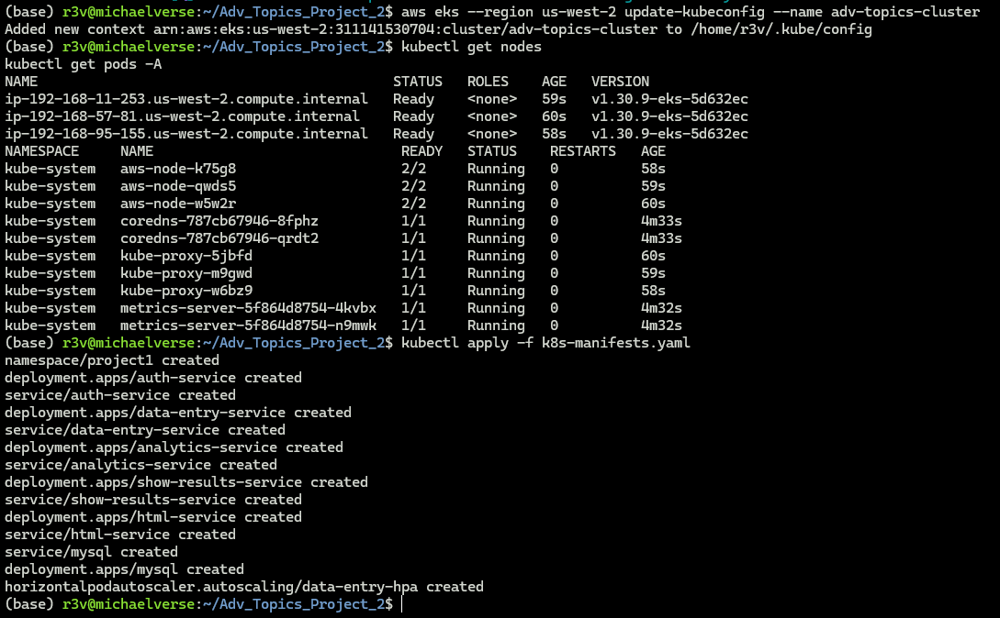
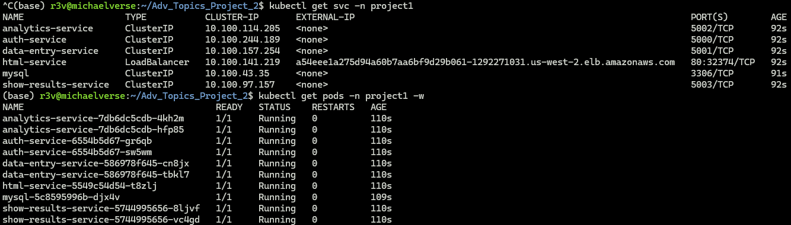
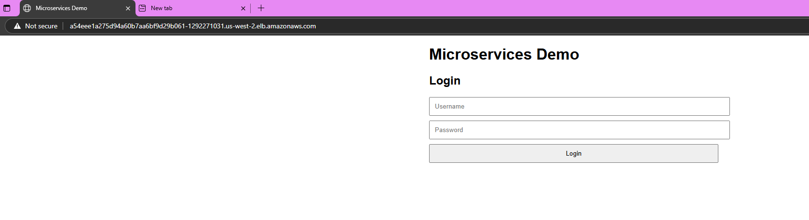
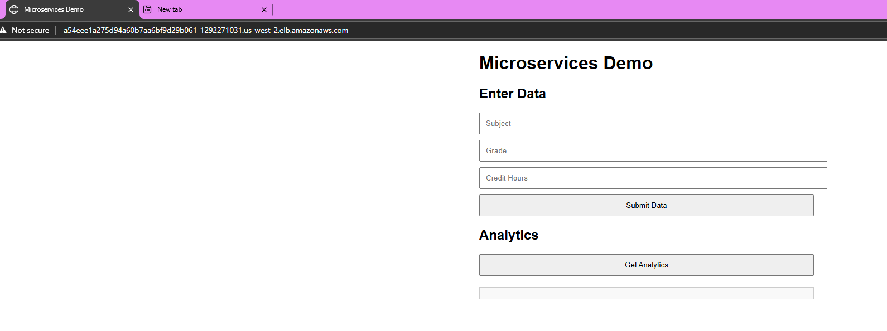
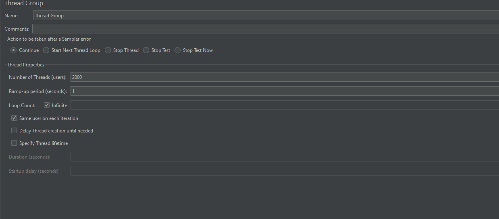
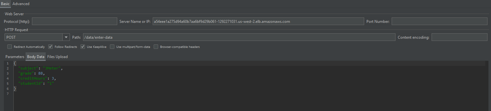
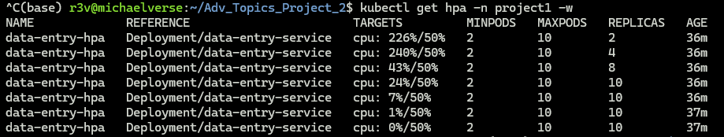

# Advanced Topics Project 2
## By Caleb Campbell

This is built upon Project 1:
https://github.com/PythThm/ACIT3495-Project1

## Microservices Overview

| Service Name         | Language/Tech | Description                          | Port |
|----------------------|----------------|--------------------------------------|------|
| **auth-service**     | Node.js        | Handles authentication               | 5000 |
| **data-entry-service** | Node.js      | Handles form submissions / data input| 5001 |
| **analytics-service** | Python        | Processes analytics logic            | 5002 |
| **show-results-service** | Python    | Displays processed analytics results | 5003 |
| **html-service**     | Nginx          | Serves the static frontend (`index.html`) | 80 |
| **mysql**            | MySQL 5.7      | Backend database                     | 3306 |

---

## Features

- **Docker-based local builds** with `:local` tags
- **Kubernetes deployments** with `Deployment` and `Service` resources
- **Horizontal Pod Autoscaler** enabled for `data-entry-service`
- **MySQL backend** configured with persistent storage (`emptyDir`)
- **Nginx static frontend** served via LoadBalancer
- **Namespace isolation** under `project1`
- **Resource requests/limits** defined for all services

---

## Getting Started

### 1. Start Minikube
```bash
minikube start
eval $(minikube docker-env)
```

### 2. Tag and Push Docker Images to Docker Hub

#### a. Tag your local images for Docker Hub
```bash
docker tag auth-service:local rev3rb698/auth-service:latest
docker tag data-entry-service:local rev3rb698/data-entry-service:latest
docker tag analytics-service:local rev3rb698/analytics-service:latest
docker tag show-results-service:local rev3rb698/show-results-service:latest
docker tag html-service:local rev3rb698/html-service:latest
```

#### b. Log in to Docker Hub
```bash
docker login
```

Enter your Docker Hub username (`rev3rb698`) and password.

#### c. Push each image
```bash
docker push rev3rb698/auth-service:latest
docker push rev3rb698/data-entry-service:latest
docker push rev3rb698/analytics-service:latest
docker push rev3rb698/show-results-service:latest
docker push rev3rb698/html-service:latest
```

### 3. Update Kubernetes Manifests for Cloud Usage

In `k8s-manifests.yaml`, update the `image` field for each service. For example:

```yaml
image: rev3rb698/auth-service:latest
```

Repeat for all services.

### 4. Deploy to Kubernetes
```bash
kubectl apply -f k8s-manifests.yaml
```

---

## Access the Frontend

```bash
minikube service html-service -n project1
```

This opens your static frontend in the browser (served via Nginx).

---

## Deploying to EKS (Amazon Elastic Kubernetes Service)

### 1. Push Docker Images to Docker Hub

Ensure all your service images are tagged and pushed to Docker Hub as described earlier:

```bash
docker tag auth-service:local rev3rb698/auth-service:latest
docker push rev3rb698/auth-service:latest
# Repeat for all services
```

### 2. Update Kubernetes Manifests

In `k8s-manifests.yaml`, update the `image` field for each service to use Docker Hub images. For example:

```yaml
image: rev3rb698/auth-service:latest
```

Repeat for:
- `auth-service`
- `data-entry-service`
- `analytics-service`
- `show-results-service`
- `html-service`

### 3. Create an EKS Cluster

Using [eksctl](https://eksctl.io/), create a cluster:

```bash
eksctl create cluster \
  --name adv-topics-cluster \
  --region us-west-2 \
  --nodegroup-name linux-nodes \
  --node-type t3.medium \
  --nodes 3 \
  --managed
```

This creates an EKS cluster with 3 managed nodes.

### 4. Update `kubectl` Config

Point `kubectl` to your new EKS cluster:

```bash
aws eks --region us-west-2 update-kubeconfig --name adv-topics-cluster
```

### 5. Apply Kubernetes YAML

Deploy your application to EKS:

```bash
kubectl apply -f k8s-manifests.yaml
```

EKS nodes will pull your images from Docker Hub and deploy them.


Below is a screenshot of the successful deployment to AWS:




### 6. HTML Service





Now we are able to enter some data to send to the dashboard!

### 7. Jmeter Loadbalance




We are simulating 2000 users trying to use this service using jmeter



Now we can see that the pods are getting a lot of cpu usage, so they start replicating themselves up to 10 replicas


